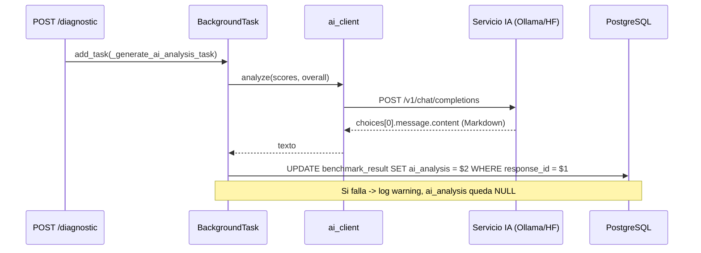

# Análisis IA

La función de análisis IA genera un reporte cualitativo en Markdown en español
(`ai_analysis`) para cada diagnóstico a partir de los scores de las 5 dimensiones.

---

## Cliente

`backend/app/services/ai_client.py` — un cliente HTTP liviano que habla el
**protocolo compatible con OpenAI** (`POST /v1/chat/completions`,
`GET /v1/models`), por lo que funciona con:

- **Ollama** (local/cloud): `AI_SERVICE_URL=http://localhost:11434`, `HF_TOKEN` vacío.
- **Hugging Face Inference Providers** (router serverless): `AI_SERVICE_URL=https://router.huggingface.co`, `HF_TOKEN=hf_...`.

| Ajuste | Env var | Propósito |
|---|---|---|
| base_url | `AI_SERVICE_URL` | Raíz del servidor; se aplica `.rstrip("/")` para evitar dobles slashes al concatenar `/v1/chat/completions` |
| api_key | `HF_TOKEN` | Header `Authorization: Bearer` solo si no está vacío |
| model | `AI_MODEL` | p. ej. `hf.co/mradermacher/NeuralQwen-2.5-1.5B-Spanish-GGUF:Q4_K_M` local / `meta-llama/Llama-3.3-70B-Instruct` nube |
| timeout | `AI_TIMEOUT_SECONDS` | Timeout de `httpx` (default 120) |
| max_tokens | `AI_MAX_TOKENS` | default 512 |

> **Nota:** Si `HF_TOKEN` está vacío (caso Ollama local), `_headers()` no incluye
> el header `Authorization` — Ollama no requiere autenticación.

### Cuerpo del request

```jsonc
{
  "model": "<AI_MODEL>",
  "messages": [
    { "role": "system", "content": "<SYSTEM_PROMPT>" },
    {
      "role": "user",
      "content": "{\"scores\": {\"visibility\": 80.0, ...}, \"overall_score\": 72.0}\n\nGenera el análisis del diagnóstico según las instrucciones del sistema."
    }
  ],
  "max_tokens": 512,
  "temperature": 0.4,
  "top_p": 0.9
}
```

- El prompt de sistema (`SYSTEM_PROMPT`) indica el tono de analista senior de
  data centers, la estructura de salida y un límite de **máximo 400 palabras** en
  Markdown en español con: `## Resumen` · `## Fortalezas` ·
  `## Áreas de mejora` · `## Recomendaciones (3 accionables)`.
- Los scores se redondean a 1 decimal; el JSON usa `ensure_ascii=False`.

---

## Modelo de ejecución



- Corre tras cada diagnóstico **nuevo** (no en replays), por lo que nunca bloquea
  la respuesta del POST.
- Degrada con gracia: si el servicio no está disponible o devuelve un cuerpo
  vacío, el código usa `logger.warning` (no `logger.error`) — degradación suave
  intencional — y `ai_analysis` queda `NULL` sin romper el diagnóstico.
- `raise_for_status()` + guarda de contenido vacío lanzan `ValueError` (manejado por la tarea).
- Probe de salud: `GET /health/ai` → `ai_client.health_check()` llama a
  `GET /v1/models` (timeout 5s).

---

## Salud

| Endpoint | Respuesta |
|---|---|
| `GET /health/ai` | `{status: "ok"}` si `GET {AI_SERVICE_URL}/v1/models` devuelve 200, si no `{status: "unavailable"}` — el probe usa timeout fijo de **5 s** (hardcodeado en `ai_client.py`) |

El análisis guardado se lee con `GET /api/v1/diagnostic/{id}` (campo `ai_analysis`).