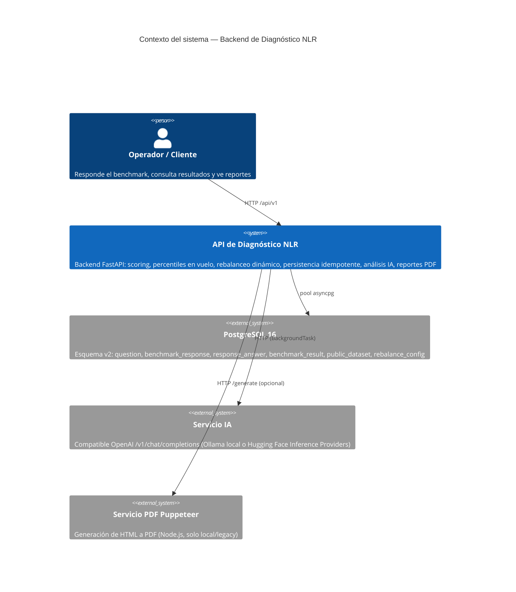
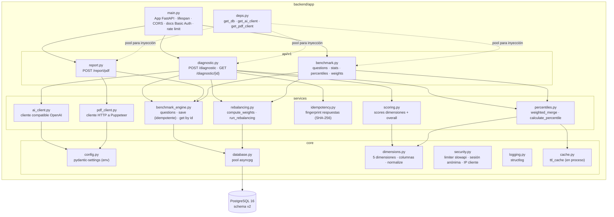

# Arquitectura

Este documento describe la arquitectura del **Backend de Diagnóstico NLR** a
nivel de contexto del sistema y de componentes, además del flujo de datos y la
topología de ejecución/despliegue.

---

## Contexto del sistema

---

## Mapa de componentes (backend/app)

La aplicación FastAPI se divide en cuatro capas: `core` (infraestructura),
`models` (esquemas), `services` (lógica de negocio / repositorios) y `api/v1`
(controladores HTTP). `main.py` conecta todo.

---

## Ejecución y flujo de datos

Propiedades clave de la ejecución:

- **Lifespan** (`app/main.py`): inicializa el logging estructurado y el pool
  asyncpg al arrancar; cierra el pool al apagar.
- **Pool de base de datos** (`core/database.py`): se inicializa en el
  `lifespan` de FastAPI al arrancar la app (en serverless, esto ocurre en el
  cold start de cada instancia). Pool pequeño
  (`max_size=3`) porque cada instancia serverless abre el suyo.
  `statement_cache_size=0` para compatibilidad con el pooler transaction de Supabase.
- **Flujo de request**: HTTP → router (`api/v1`) → services → PostgreSQL. Las
  llamadas externas (IA, PDF) se hacen por HTTP con `httpx`.
- **POST /diagnostic** es asíncrono: la respuesta se devuelve de inmediato y los
  efectos secundarios (rebalanceo + análisis IA) corren como `BackgroundTask`.
- **Cliente IA** (`services/ai_client.py`): corre exclusivamente como
  `BackgroundTask`, nunca en el path crítico del request. Esto garantiza que
  una latencia o fallo del servicio IA no afecte el tiempo de respuesta del
  endpoint.
- **Cache**: `_fetch_dimension_stats` y `_load_blended_scores` son caches TTL en
  proceso de 30s (por instancia, no distribuido).

El flujo completo del diagnóstico está en [business-logic.md](./business-logic.md).