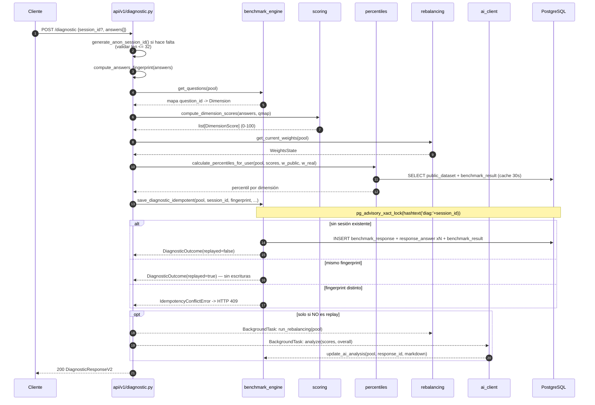
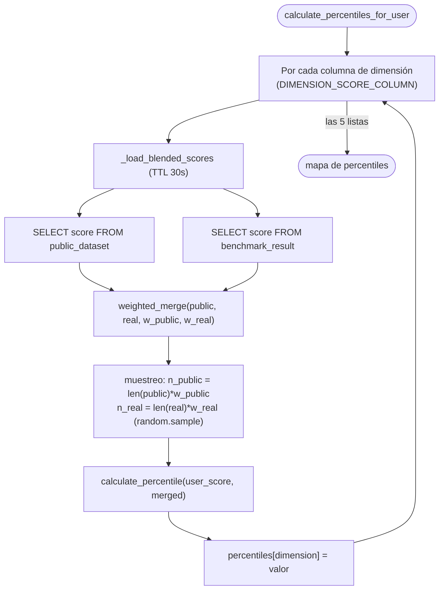
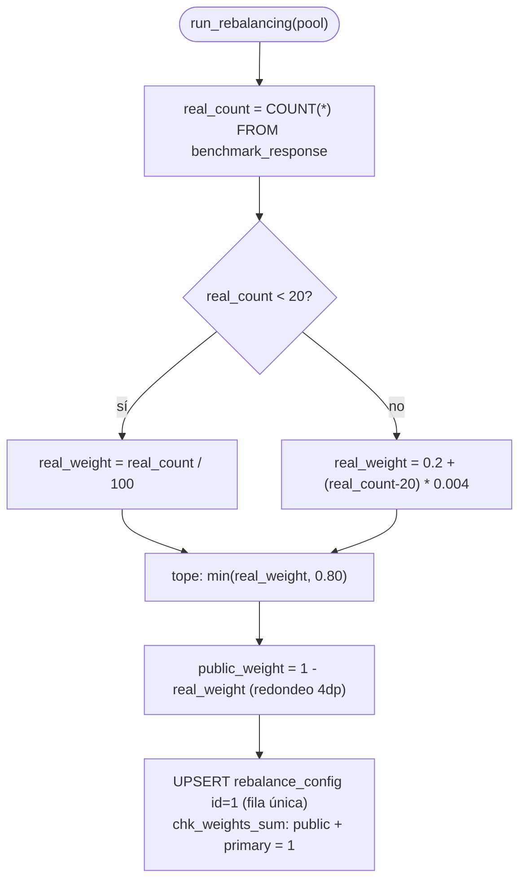
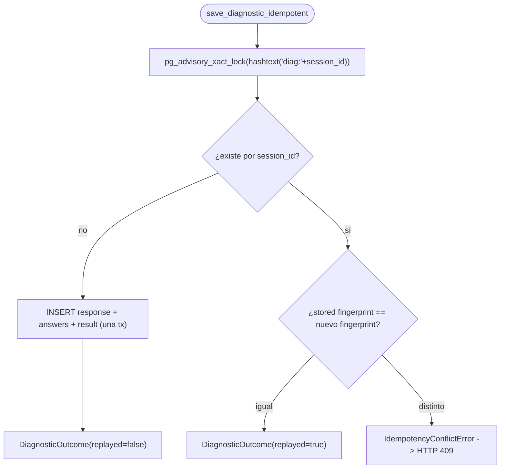

# Lógica de negocio

Algoritmos centrales detrás del scoring, los percentiles, el rebalanceo y la
idempotencia.

---

## Las 5 dimensiones

Fuente única: `backend/app/core/dimensions.py` (`ORDERED_DIMENSIONS`).

| Dimensión | Significado |
|---|---|
| `visibility` | Vista unificada en tiempo real de energía, cooling y workloads |
| `friction` | La interfaz donde se pierde capacidad |
| `latency` | Velocidad de ajuste de cooling/energía ante cambios de workload |
| `quantification` | Conocimiento de la stranded capacity propia |
| `blockers` | Obstáculos organizacionales o técnicos que impiden resolver el problema |

---

## Flujo completo de POST /diagnostic



---

## Scoring

Definido en `backend/app/services/scoring.py`.

- Cada respuesta es 1-5. El score de dimensión es el promedio de sus respuestas
  normalizado a 0-100: `score = (promedio / 5) * 100` (`normalize_answer`,
  `core/dimensions.py`).
- Las dimensiones sin respuestas quedan en `0.0` (por diseño: el frontend envía
  respuestas para todas las preguntas activas).
- El overall es el promedio simple de los 5 scores de dimensión.
- El score normalizado por pregunta `(value / 5) * 100` también se guarda en
  `response_answer.score`.

---

## Percentiles en vuelo

Definido en `backend/app/services/percentiles.py`. No hay tabla precacheadas.



`calculate_percentile`: el score del usuario se agrega al dataset combinado
(`all_scores = combined_dataset + [user_score]`), se cuentan los scores
estrictamente menores a él (`s < user_score`), y se divide por el total de la
lista (`len(all_scores)` = tamaño del dataset + 1). Devuelve `50.0` si el
dataset mezclado está vacío. Los umbrales
(`compute_percentile_thresholds`) por defecto son P10/P25/P50/P75/P90/P99.

---

## Rebalanceo dinámico

Definido en `backend/app/services/rebalancing.py`. Fórmula de la issue #23:

```
si real_count < 20:  real_weight = real_count / 100
si no:               real_weight = 0.2 + (real_count - 20) * 0.004
real_weight = min(real_weight, 0.80)
public_weight = 1 - real_weight
```



Notas:

- Corre como `BackgroundTask` tras cada diagnóstico **nuevo**.
- `real_weight` se guarda en la columna `primary_weight`.
- Las lecturas hacen fallback a `public_weight=1.0`, `real_weight=0.0` cuando no
  hay fila guardada.
- `real_count < 0` lanza `ValueError`.

---

## Idempotencia

Estilo Stripe: `session_id` actúa como Idempotency-Key.



- Fingerprint = SHA-256 sobre los pares `(question_id, value)` **ordenados** —
  reordenar respuestas no cambia el resultado (`idempotency.py`).
- La concurrencia se serializa con un advisory lock de PostgreSQL con alcance de
  transacción.
- En un replay no se escriben filas ni corren efectos en background; la respuesta
  refleja el diagnóstico guardado + los percentiles **actuales**.
- La restricción `UNIQUE` de `benchmark_response.anonymous_code` mantiene el
  anonimato y la unicidad.