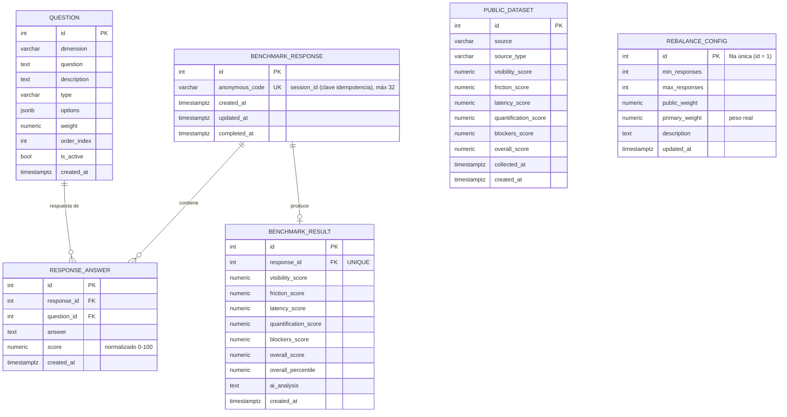

# Esquema de base de datos v2

Esquema de PostgreSQL definido en `backend/scripts/schema-v2.sql`. Datos seed en
`backend/scripts/seed-v2.sql` (15 preguntas + 20 filas del dataset público).

---

## DER

---

## Tablas

### `question`

Preguntas del benchmark agrupadas por dimensión.

| Columna | Tipo | Notas |
|---|---|---|
| `id` | SERIAL PK | |
| `dimension` | VARCHAR(50) | Una de las 5 dimensiones |
| `question` | TEXT | Texto de la pregunta |
| `description` | TEXT | Opcional |
| `type` | VARCHAR(20) | `scale`, `single_choice`, `multiple_choice`, `text`, `numeric` |
| `options` | JSONB | Opciones para preguntas de selección |
| `weight` | NUMERIC(5,2) | `CHECK (weight >= 0)` |
| `order_index` | INT | Orden canónico |
| `is_active` | BOOLEAN | Solo se devuelven preguntas activas |
| `created_at` | TIMESTAMPTZ | |

**Seed**: 15 preguntas (3 por dimensión). Tipos usados: `scale` (conjunto de opciones propio) y `single_choice`.

### `benchmark_response`

Una fila por sesión de encuesta completada de forma anónima.

| Columna | Tipo | Notas |
|---|---|---|
| `id` | SERIAL PK | |
| `anonymous_code` | VARCHAR(32) UNIQUE | El `session_id`; **clave de idempotencia** |
| `created_at` | TIMESTAMPTZ | |
| `updated_at` | TIMESTAMPTZ | |
| `completed_at` | TIMESTAMPTZ | Se setea a `NOW()` al insertar |

### `response_answer`

Una fila por pregunta respondida, con el score normalizado por pregunta.

| Columna | Tipo | Notas |
|---|---|---|
| `id` | SERIAL PK | |
| `response_id` | INT FK | → `benchmark_response.id`, `ON DELETE CASCADE` |
| `question_id` | INT FK | → `question.id`, `ON DELETE RESTRICT` |
| `answer` | TEXT | Respuesta cruda (1-5 como string) |
| `score` | NUMERIC(5,2) | Normalizado 0-100 |
| `created_at` | TIMESTAMPTZ | |

Restricción UNIQUE: `(response_id, question_id)`.

### `benchmark_result`

Resultados calculados por encuesta.

| Columna | Tipo | Notas |
|---|---|---|
| `id` | SERIAL PK | |
| `response_id` | INT FK UNIQUE | → `benchmark_response.id`, `ON DELETE CASCADE` |
| `visibility_score` | NUMERIC(5,2) | Check 0-100 |
| `friction_score` | NUMERIC(5,2) | Check 0-100 |
| `latency_score` | NUMERIC(5,2) | Check 0-100 |
| `quantification_score` | NUMERIC(5,2) | Check 0-100 |
| `blockers_score` | NUMERIC(5,2) | Check 0-100 |
| `overall_score` | NUMERIC(5,2) | Promedio simple de las dimensiones |
| `overall_percentile` | NUMERIC(5,2) | Guardado pero se recalcula en vuelo al leer |
| `ai_analysis` | TEXT | Markdown del servicio IA (nullable) |
| `created_at` | TIMESTAMPTZ | |

### `public_dataset`

Datos públicos de referencia (seed: 20 filas generadas desde el dataset de
telemetría NLR HPC PUE vía `scripts/nlr_feature_engineering.py`).

| Columna | Tipo | Notas |
|---|---|---|
| `id` | SERIAL PK | |
| `source` | VARCHAR(100) | p. ej. `nlr-hpc-pue` |
| `source_type` | VARCHAR(50) | p. ej. `telemetria` |
| `visibility_score` … `blockers_score` | NUMERIC(5,2) | Checks 0-100 |
| `overall_score` | NUMERIC(5,2) | Check 0-100 |
| `collected_at` | TIMESTAMPTZ | |
| `created_at` | TIMESTAMPTZ | |

### `rebalance_config`

Tabla de fila única que guarda los pesos vigentes del blend público/real.

| Columna | Tipo | Notas |
|---|---|---|
| `id` | SERIAL PK | Siempre `1` (`CONFIG_ID`) |
| `min_responses` | INT | Default 0 |
| `max_responses` | INT | Nullable |
| `public_weight` | NUMERIC(5,2) | 0-1 |
| `primary_weight` | NUMERIC(5,2) | Peso de las respuestas reales, 0-1. En la lógica de negocio se llama `real_weight`; el nombre de columna en BD es `primary_weight` |
| `description` | TEXT | |
| `updated_at` | TIMESTAMPTZ | |

Restricción `chk_weights_sum`: `public_weight + primary_weight = 1`.

---

## Índices y vista

| Objeto | Definición |
|---|---|
| `idx_question_dimension` | `question(dimension)` |
| `idx_response_created_at` | `benchmark_response(created_at)` |
| `idx_answer_question` | `response_answer(question_id)` |
| `idx_publicdataset_source` | `public_dataset(source)` |
| `vw_response_scores` | Vista que une `benchmark_response` + `benchmark_result` |

Extensión requerida: `pgcrypto`.

## Mapeo de columnas (fuente única)

Definido en `backend/app/core/dimensions.py`: el diccionario `DIMENSION_SCORE_COLUMN` mapea cada enum `Dimension` a su columna fija en `public_dataset` / `benchmark_result`. **Este archivo es la fuente de verdad para todos los servicios** — cualquier cambio en los nombres de columna debe realizarse aquí y se propagará automáticamente al resto del sistema.

| Enum de dimensión | Columna |
|---|---|
| `visibility` | `visibility_score` |
| `friction` | `friction_score` |
| `latency` | `latency_score` |
| `quantification` | `quantification_score` |
| `blockers` | `blockers_score` |