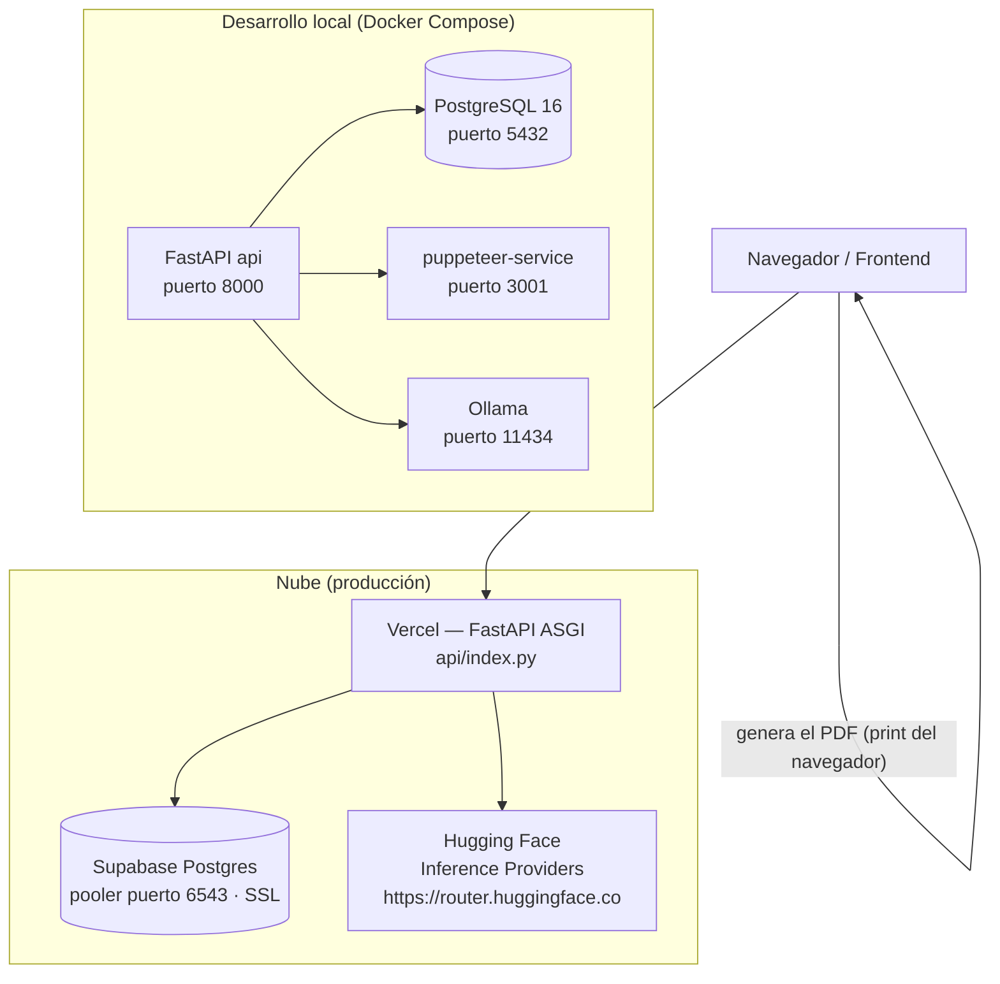

# Despliegue

Dos modos de operación: **local** (Docker Compose o a mano) y **nube**
(Supabase + Vercel + Hugging Face Inference Providers).

## Estado actual

La API ya está **desplegada en producción**:

- **Vercel**: función serverless desde `backend/` (entrypoint `api/index.py`, `maxDuration: 300`).
- **Supabase**: PostgreSQL vía el pooler transaction (puerto 6543, TLS).
- **IA**: Hugging Face Inference Providers (protocolo OpenAI-compatible).

El reporte PDF se genera del lado del cliente (frontend); `puppeteer-service` no está desplegado.

---

## Topología de despliegue



- **Local**: `db`, `api`, `puppeteer` y (opcionalmente) `ai`/Ollama. El schema y
  el seed se aplican al primer arranque vía `/docker-entrypoint-initdb.d/`.
- **Nube**: Vercel aloja toda la app FastAPI como una sola función serverless
  (`api/index.py`, `maxDuration: 300`). El PDF lo genera el frontend del lado
  del cliente (print del navegador), por lo que `puppeteer-service` **no** se
  despliega.

---

## Docker Compose

Desde la raíz del repo:

```bash
docker compose up -d --build
docker compose logs -f api
docker compose down          # detener
docker compose down -v       # detener + reset DB (schema+seed se re-aplican al arrancar)
```

| Servicio | Imagen / Fuente | Puerto | Notas |
|---|---|---|---|
| `db` | `postgres:16-alpine` | 5432 (dev) | Monta `schema-v2.sql` → `01-schema.sql`, `seed-v2.sql` → `02-seed.sql` |
| `api` | `./backend/Dockerfile` | 8000 | Depende de `db` (healthy) y `puppeteer` |
| `puppeteer` | `./backend/puppeteer-service/Dockerfile` | 3001 (dev) | Requiere `shm_size: 1gb` |
| `ai` | — (sin imagen ni build) | 11434 (dev) | Solo mapea el puerto 11434; Ollama debe correr en el host (ver nota abajo) |

**`docker-compose.yml`** define `db`, `api` y `puppeteer`. **`docker-compose.override.yml`**
se fusiona automáticamente en dev y expone los puertos al host (`5432`, `3001`,
`11434`) además de aplicar overrides de entorno dev (`ENVIRONMENT=development`,
`DEBUG=true`, `LOG_JSON=false`, bind-mount de `./backend/app`). El bloque `ai`
del override **solo declara el mapeo de puerto** — no levanta ningún contenedor.

> **Nota sobre Ollama (servicio `ai`):** El override de dev mapea el puerto 11434
> pero no levanta un contenedor Ollama. Instalá Ollama en el host
> (`curl -fsSL https://ollama.com/install.sh | sh`) e inicialo con `ollama serve`
> antes de levantar el stack. El servicio IA es **opcional**: si no está disponible,
> el análisis IA queda en `NULL` sin romper el diagnóstico.

> Para producción coré sin el override: `docker compose -f docker-compose.yml up -d --build`.

## Entrypoint serverless (Vercel)

- `backend/api/index.py` contiene únicamente `from app.main import app` — reexporta
  el objeto ASGI sin ninguna lógica adicional. Vercel detecta ese objeto y lo sirve
  como una única función serverless.
- `backend/vercel.json` setea `maxDuration: 300` para `api/index.py`.
- Las variables de entorno las inyecta Vercel; el pool de BD se crea por
  instancia (`POSTGRES_MAX_POOL_SIZE` bajo, `statement_cache_size=0`).

---

## Variables de entorno

Fuente única: `backend/app/core/config.py` y `backend/.env.example`.

| Variable | Default | Descripción |
|---|---|---|
| `APP_NAME` | `NLR Diagnostic API` | Título de la app |
| `APP_VERSION` | `0.1.0` | Versión de la API |
| `ENVIRONMENT` | `development` | `development` / `staging` / `production` |
| `DEBUG` | `false` | Habilita `/docs` y debug |
| `API_V1_PREFIX` | `/api/v1` | Prefijo de los routers |
| `HOST` | `0.0.0.0` | Bind del servidor |
| `PORT` | `8000` | Puerto del servidor |
| `POSTGRES_HOST` | `localhost` | Host de la BD (nube: `aws-0-<region>.pooler.supabase.com`) |
| `POSTGRES_PORT` | `5432` | Puerto de la BD (pooler Supabase: `6543`) |
| `POSTGRES_USER` | `nlr` | Usuario de la BD (Supabase: `postgres.<ref>`) |
| `POSTGRES_PASSWORD` | `nlr_secret` | Contraseña de la BD |
| `POSTGRES_DB` | `nlr_diagnostic` | Nombre de la BD (Supabase: `postgres`) |
| `POSTGRES_MIN_POOL_SIZE` | `0` | Conexiones mínimas del pool |
| `POSTGRES_MAX_POOL_SIZE` | `3` | Conexiones máximas del pool |
| `POSTGRES_SSL` | `false` | `true` para Supabase (exige TLS) |
| `POSTGRES_CA_CERT` | *(vacío)* | PEM de `prod-ca-2021.crt` → habilita `verify-full` |
| `RATE_LIMIT_REQUESTS` | `60` | Requests por ventana |
| `RATE_LIMIT_WINDOW_SECONDS` | `60` | Segundos de la ventana |
| `TRUST_PROXY_HEADERS` | `false` | `true` detrás de un proxy inverso de confianza (Vercel) |
| `CORS_ORIGINS` | `["http://localhost:3000"]` | Orígenes permitidos |
| `PDF_SERVICE_URL` | *(vacío)* | URL base de Puppeteer (vacío → `/report/pdf` = 501) |
| `PDF_SERVICE_TIMEOUT_SECONDS` | `30` | Timeout del PDF |
| `AI_SERVICE_URL` | `http://localhost:11434` | URL base de IA (nube: `https://router.huggingface.co`) |
| `HF_TOKEN` | *(vacío)* | Token Read de HF (vacío → sin header `Authorization`) |
| `AI_MODEL` | `hf.co/mradermacher/NeuralQwen-2.5-1.5B-Spanish-GGUF:Q4_K_M` | Id del modelo |
| `AI_TIMEOUT_SECONDS` | `120` | Timeout de IA |
| `AI_MAX_TOKENS` | `512` | Máximo de tokens de IA |
| `LOG_LEVEL` | `INFO` | `DEBUG`/`INFO`/`WARNING`/`ERROR` |
| `LOG_JSON` | `false` | Logs estructurados en JSON |
| `SWAGGER_PASSWORD` | *(vacío)* | Password Basic Auth de `/docs` en producción |

> **Nota:** Las variables con default hardcodeado (`APP_VERSION=0.1.0`, `APP_NAME`,
> `API_V1_PREFIX`, etc.) no son necesarias en `.env` a menos que se quieran
> sobreescribir. Solo las variables sin default sensato (`POSTGRES_PASSWORD`,
> `HF_TOKEN`, `POSTGRES_CA_CERT`) son obligatorias en producción.

---

## Resumen de configuración en la nube

1. **Supabase (free)**: SQL Editor → ejecutar `backend/scripts/schema-v2.sql` y
   luego `backend/scripts/seed-v2.sql`. Usar la connection string del **pooler
   transaction** (puerto 6543).
2. **HF Inference Providers (free)**: crear un token Read (`hf_...`), usar
   `AI_SERVICE_URL=https://router.huggingface.co`.
3. **Vercel**: importar el repo, **Root Directory = `backend`**, Framework
   Preset **Other** (entrypoint `api/index.py`). Setear env vars:
   `ENVIRONMENT=production`, `TRUST_PROXY_HEADERS=true`, `LOG_JSON=true`,
   `POSTGRES_SSL=true`, `POSTGRES_CA_CERT=<PEM>`, `PDF_SERVICE_URL=` (vacío).
4. Cada push re-despliega; los branches generan previews.

> [!NOTE]
> **Rate limit de `slowapi` en Vercel:** El límite es **por instancia**, no global
> (aceptable para una demo; un proxy como Cloudflare permitiría un límite global
> consistente).
>
> La primera llamada a la IA tras un cold start de HF puede tardar 60–120 s+
> en CPU; el `BackgroundTask` degrada con gracia (`ai_analysis` queda `NULL`).